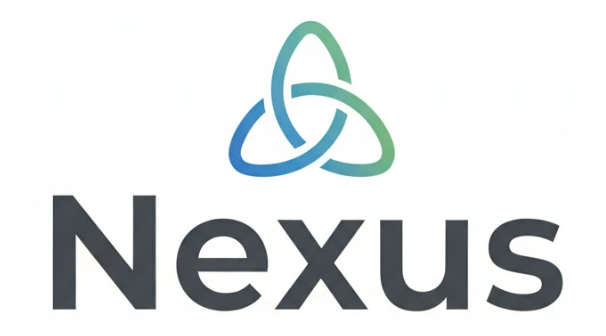
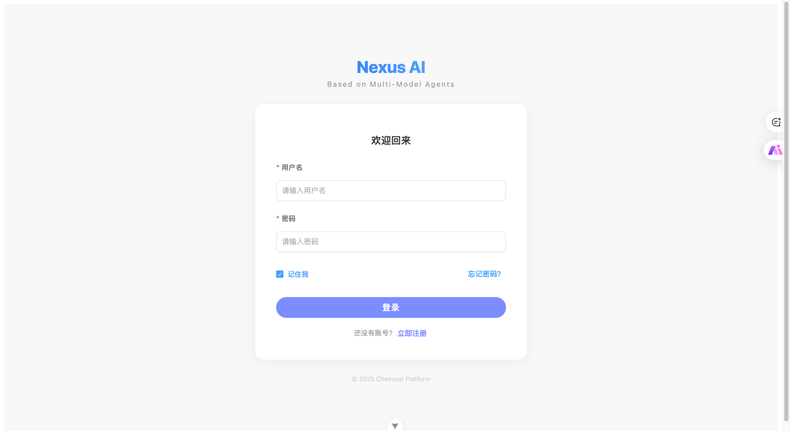
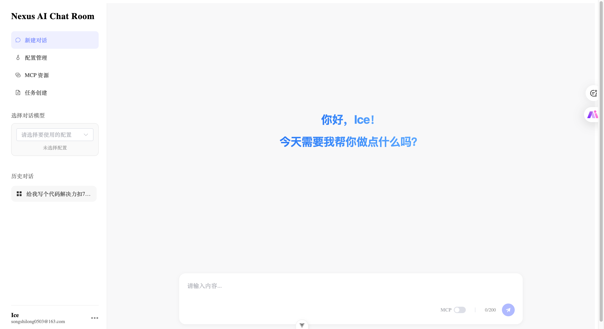
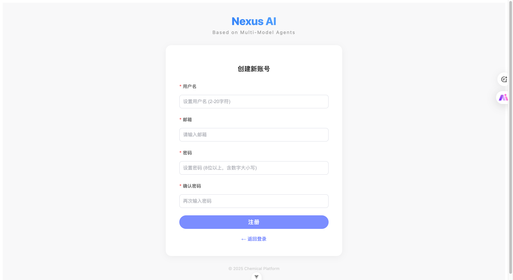
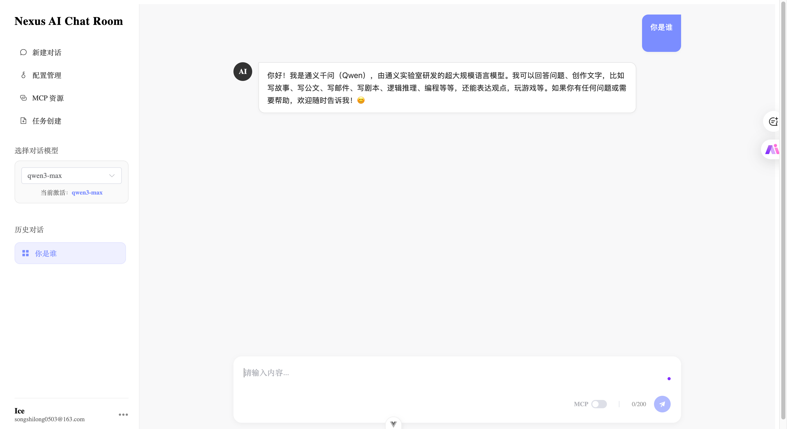
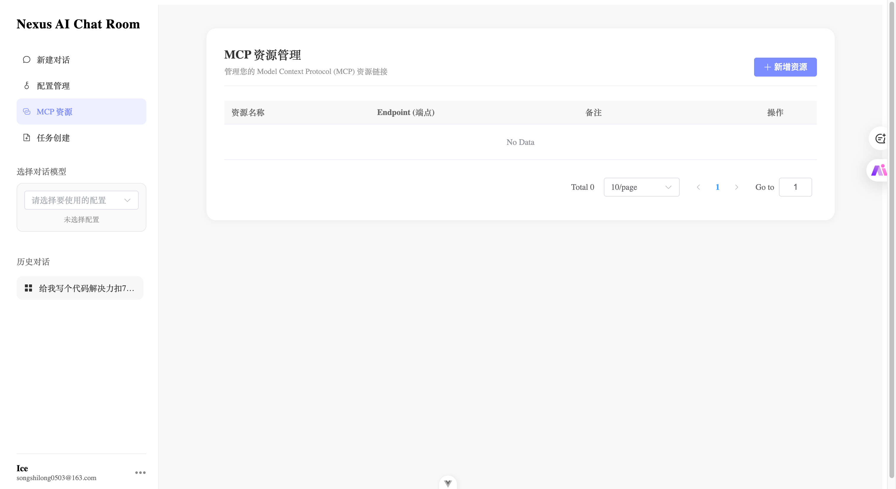
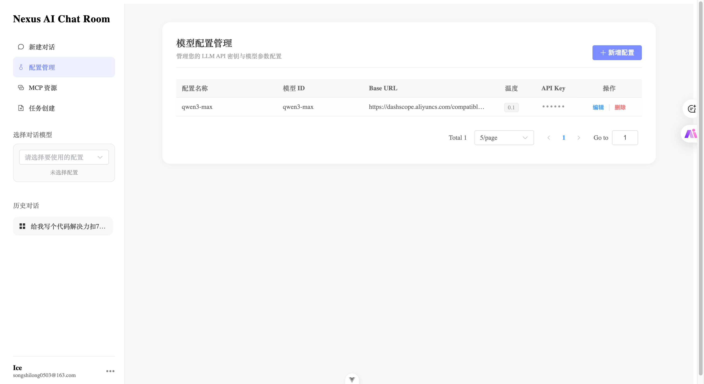

<p align="center">
  
</p>

<h1 align="center">Nexus Frontend</h1>

<p align="center">
  <a href="https://vuejs.org/">
    
  </a>
  <a href="https://vitejs.dev/">
    
  </a>
  <a href="https://developer.mozilla.org/en-US/docs/Web/JavaScript">
    
  </a>
</p>

<p align="center">
  <strong>A modern, AI-native chat interface built for the Nexus ecosystem.</strong>
</p>

---

> [!IMPORTANT]
> **Disclaimer / 免责声明**
>
> The front-end code of this project is entirely generated by **Gemini**. It is for learning and exchange purposes only and must not be used for any commercial purposes.
>
> 本项目前端代码全部基于 **Gemini** 生成，请勿用于商业用途，仅供学习交流使用。

## ✨ Features

Based on the interface design, Nexus Frontend provides:

- **🔐 User Authentication**: Secure Login and Registration pages.
- **💬 AI Chat Interface**: Smooth streaming conversation experience.
- **🔌 MCP Integration**: Management for Model Context Protocol resources.
- **🤖 Model Management**: Visual interface for configuring and switching AI models.

## 📸 Demo Screenshots

|                             Authentication                             |                            Main Interface                            |
| :--------------------------------------------------------------------: | :------------------------------------------------------------------: |
|        |        |
|                              **Register**                              |                             **Examples**                             |
|  |  |
|                             **MCP Config**                             |                          **Model Settings**                          |
|            |      |

## 🛠️ Development Setup

To ensure the best development experience, we recommend the following setup:

### IDE Support

- **[VS Code](https://code.visualstudio.com/)** + **[Vue - Official](https://marketplace.visualstudio.com/items?itemName=Vue.volar)** (Extension)
- _Note: Please disable Vetur if installed to avoid conflicts._

### Browser DevTools

- **Chrome/Edge**: [Vue.js devtools](https://chromewebstore.google.com/detail/vuejs-devtools/nhdogjmejiglipccpnnnanhbledajbpd)
- **Firefox**: [Vue.js devtools](https://addons.mozilla.org/en-US/firefox/addon/vue-js-devtools/)
- **Configuration**: Enable [Custom Object Formatter](http://bit.ly/object-formatters) in your browser's DevTools settings for better console logs.

## 🚀 Quick Start

### 1. Installation

Install the project dependencies using npm:

```sh
npm install
```

### 2. Development

Start the local development server with hot-reload:

```sh
npm run dev
```

### Production Build

Compile and minify the application for production deployment:

```sh
npm run build
```
